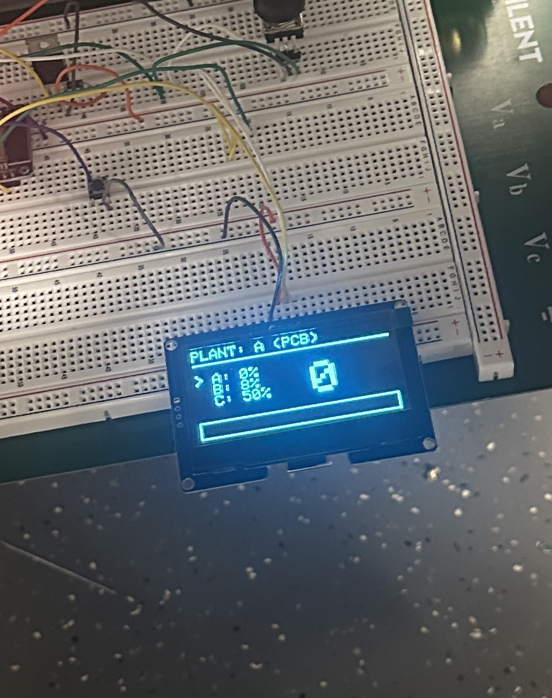

# April 13 - April 19

Since this week is the last week before the mock demo, we should get all the subsystems functionality done. 
This week I'm starting to work on the user interface subsystem. 
- First I changed the display from LCD to OLED as it is bigger and looks smoother.

I'm still using the breadboard for the watering can module because the main PCB is not ready yet.

So I've tested and confirmed that it is able to receive the readings from three different sensor nodes, and able to update the readings on the display successfully. 

I added the rectangular bar at the bottom of the display that will be filled up according to the moisture value. For example, if the reading is 100, the bar will be completely filled up. 

- Next I added the rotary encoder for users to select the plant. 

The two-pins side is for the switch while the three-pins side is for the encoder. 

We're using the encoder for plant selection and the switch is a button for "start watering". 

The first issue I encountered with the encoder was that it was skipping the middle plant whenever I rotate it.

To fix it, I just made the partition of the encoding smaller.
~~~
    int rawCount = encoder.getCount();
    int divider = 2; 
    int calculatedSelection = rawCount / divider;
~~~

I also added the "infinite scrolling" logic for the encoder so that users won't feel "stuck" once they rotate the knob past the first or last plant.

~~~
 if(calculatedSelection > 2){
    encoder.setCount(0);
    selectedPlant = 0;
} else if (calculatedSelection < 0){
    encoder.setCount(2 * divider);
    selectedPlant = 2;
} else{
    selectedPlant = calculatedSelection;
}
~~~

