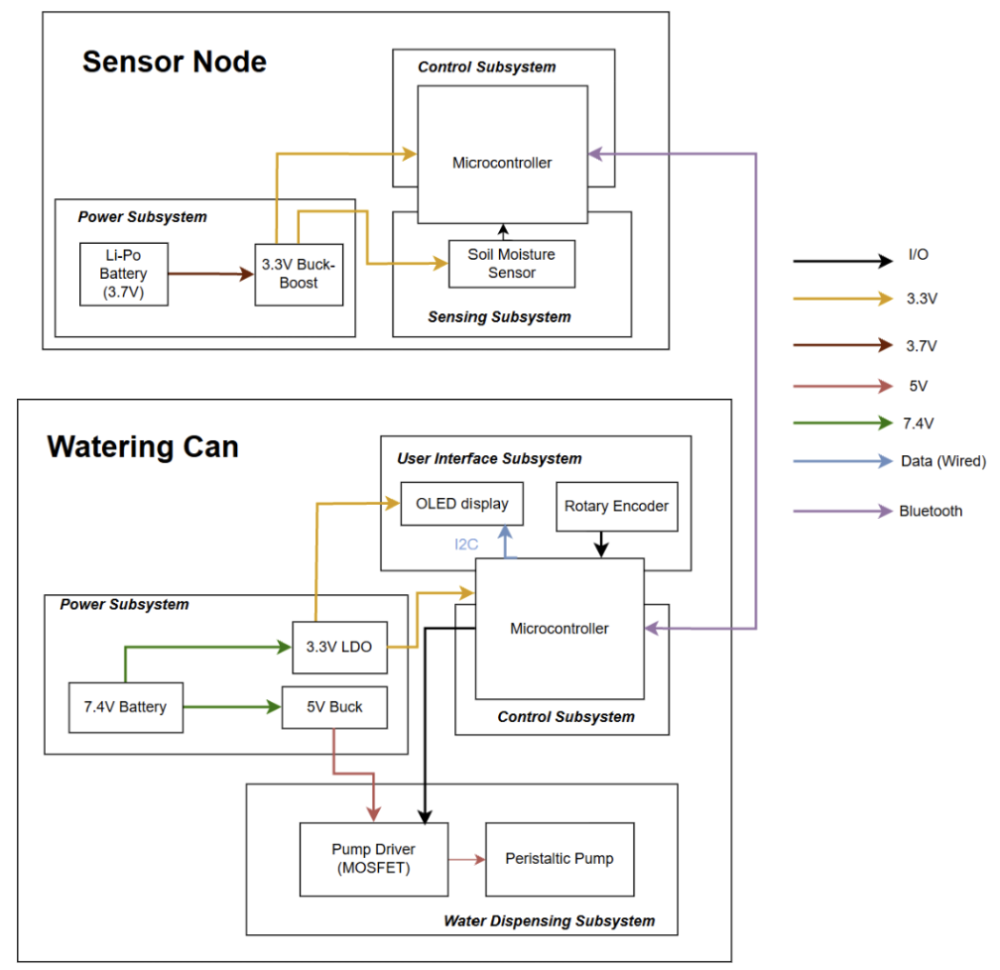
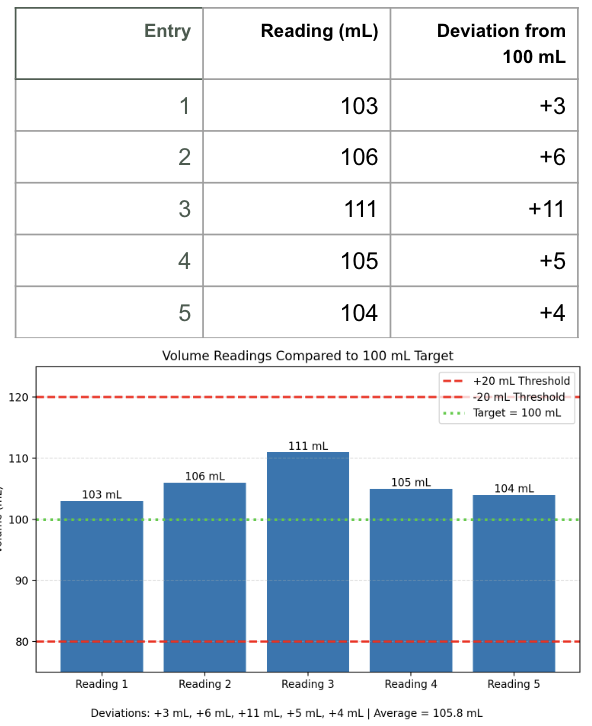

# April 20 - 26
This week was a lot of staying in lab and working on final parts of the project.

- Now that we have more sensor nodes which are on PCB, I worked on soldering the connector pins, programming the ESP32-S3, integrating the code and verified the connection between transmitter and receiver.
- I looked up different pump runtime logic for different plants by defining their the moisture threshold and max volume of water needed. 
- Charis made some changes to the power subsystem so I updated the block diagram. 

- Idris worked on 3D printing of the enclosure and we tried to make the packaging look as professional as possible.
- We went through the requirements and verifications table that we wrote in design document and compiled all the results in the final report.

Pump accuracy verification result:

- With all the results, we worked on the mock presentations.

- We also bought three plants and tried attaching the sensor nodes to them.

# April 22
Mock Demo at 11am

# April 24
Mock Presentation at 4.20pm

