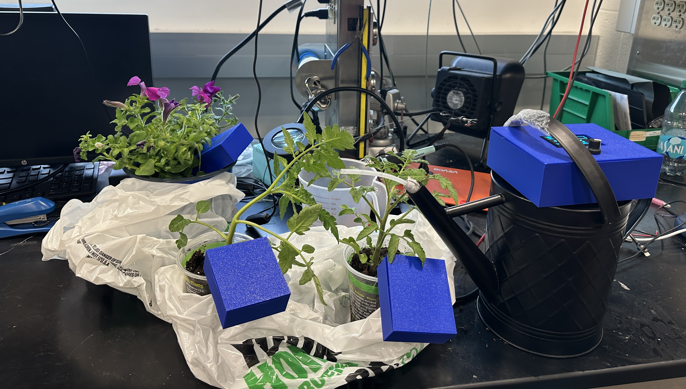

# April 27 - 29

This week is the wrapping up of project as it is the final demo week. 
- The final control system flowchart that I implemented is as below.

- There were some last minute issue that we faced such as frying the ESP32 chip on the PCB, and the LDO being burned out.
- We were able to solve them by resoldering those components and made some component changes to the power subsystem. 

# April 28 - 29
Final Demo at 2pm

# April 30
Final Presentation at 1.20pm

# May 1 - May 6
- Reflected on what went wrong, what we could have done better, and potential scalability/improvement of the project (cost, component selection, overall packaging)
- Worked on submitting video and final report.

# May 6 
Final Report due 11.59pm