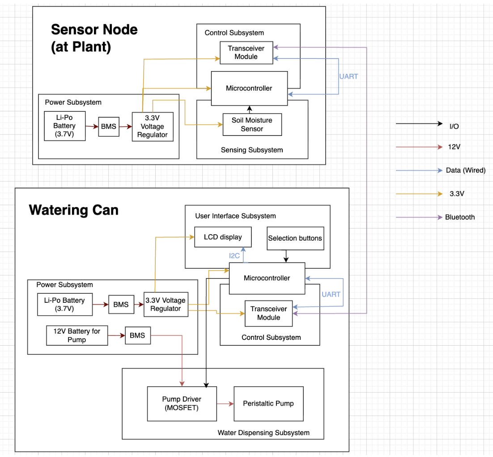

# February 10

After receiving email from our TA, I worked on drawing the first iteration block diagram of our project to bring to the TA meeting.

Idris and I also worked on listing out three high-level requirements of the project to bring to the TA meeting as in the [Initial High Level Requirement markdown file](../high_level_reqs.md).

After our Project RFA got approved, this is the first time that we met our TA Mingrui. We got to know all about the course logistics and most importantly how to order components from the E-shop or from other websites. We also decided on the weekly meeting time with TA to be every Monday 10.30am.

# February 11 - February 12
We met up and started working on the project proposal. I have a clearer view of what each subsystem should do and how they integrate with one another.

# February 13
Project Proposal due at 11.59pm.