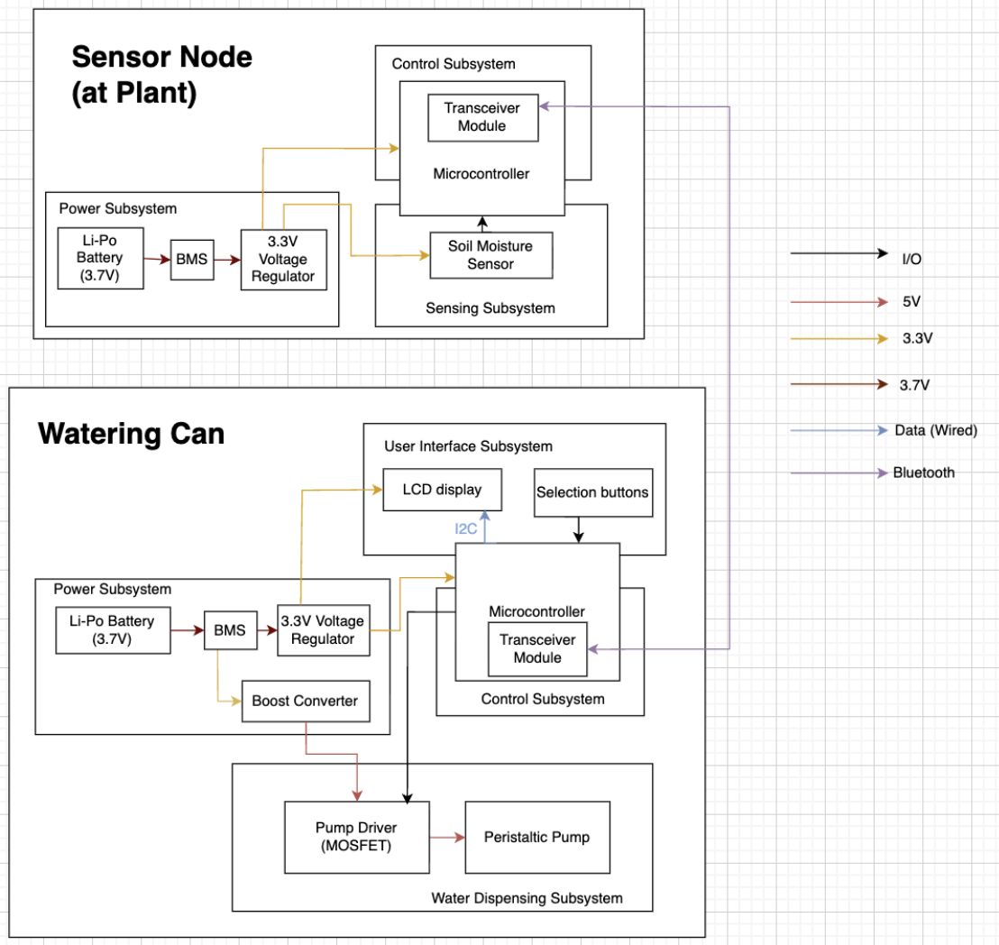

# February 23

- Had the weekly TA Meeting
- Added another high-level requirement for "Variation" to correspond for our watering can being able to recognize different types of plants and dispense different volumes of water. 
- Sent in the first E-shop order form for ESP32, capacitors, resistors, etc.

# February 24

- Received the first E-shop order components 
- Started sourcing breadboard, ESP32 Dev Module, wires, and other self service components needed for a breadboard prototype 
- After Idris finished the schematic, I helped him out with PCB layout routing.

# February 25 - 27

- We found another 5V-6V DC Power Supply peristaltic pump as compared to the 12V one earlier and decided to go with the lower power supply one.
- We decided to also changed to OLED display instead of LCD for a better visualization.
- I updated the second iteration block diagram for design document.

- We've also been discussing our system implementations and working on the design document. 

# February 26
PCB First Round Order due 4.45pm

- I did more research on the power subsystem and the components we may need such as: boost converter (from 3.7V to 5V), LDO (from 3.7V to 3.3V), and battery charging unit.

# February 27
Design Document due 11.59pm