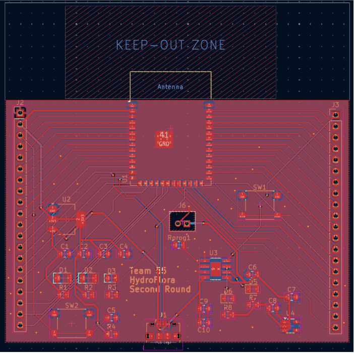
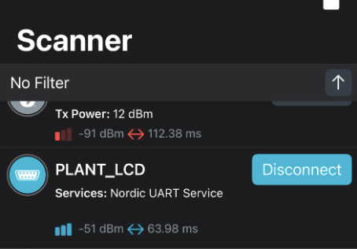

# March 02
Design Review at 1.30pm

- We received an email from a new member Charis about joining our team. After meeting her briefly for a short discussion, we agreed to let her be onboard as Idris and I were not really experienced with the power management. 
- We had a introduction session with Charis and talked about our current project scope and progress so that she could be on track.
- We decided on our team weekly meeting time to be every Friday at 10am (timing could be flexible).
- We also finally settled on the main components like pumps and sensors, and sent in our first Digikey order.

# March 03 - March 05

- I worked on the second round sensor node PCB layout routing

# March 05
PCB Second Round Order due 4.45pm

# March 06 - 09

- I worked on researching the wireless communication needed for our project and opted for Bluetooth Low Energy. 
- Tested the ESP32 as both transmitter and receiver.

~~~
#define SERVICE_UUID      "4fafc201-1fb5-459e-8fcc-c5c9c331914b"

#define CHARACTERISTIC_UUID "beb5483e-36e1-4688-b7f5-ea07361b26a8"
~~~

- Generated the above for the BLE communication using uuidgenerator.net

~~~
NimBLEAdvertising* pAdvertising = NimBLEDevice::getAdvertising();
pAdvertising->addServiceUUID(SERVICE_UUID);
pAdvertising->setName("PLANT_LCD");
pAdvertising->start();
~~~

- Worked on prototyping for breadboard demo 
- Through nRF Connect mobile app on my phone, I was able to initiate Bluetooth communication to and from the ESP32.

- The current prototype for breadboard demo next week: ESP32 able to transmit data, able to receive data and update it on the LCD display, the motor runtime determined by different values (simulating moisture levels) received on ESP32.
