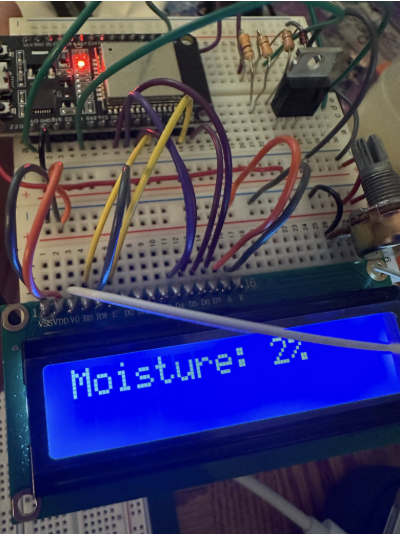

# March 10

Breadboard demo at 10.30am

The prototype that we showed for breadboard demo is as above. We decided to use OLED display, but because we don't have one yet, we used LCD first. 

- We received the first Digikey orders including pump and sensors (yeay!)

# March 12

PCB Third Round Order due 4.45pm

# March 09 - March 13
This week was just more research and figuring out stability of wireless communication. To satisfy the connection range high-level requirement, I tested out the BLE connection between my phone and ESP32 Dev Module at different distances.

|Distance(m)|  Status  |
|-----------|----------|
|    0.5    | Connected|
|    1.0    | Connected|
|    3.0.   | Connected|