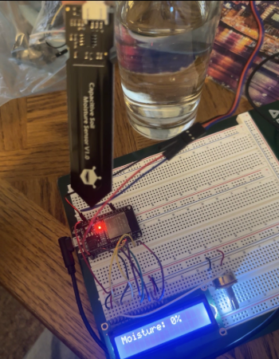
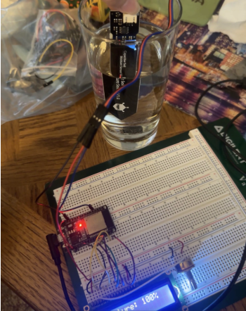

# March 16 - March 22
SPRING BREAK :)

# March 23
Back from the break, we had to pick up the pace for a better progress of the project.
- We finally received the PCB for first and second round order today.
- Decided to meetup more in the lab this week to solder the PCB
- Also ordered more Digikey components mainly for the power subsystem

# March 25
- Went to the lab and Charis showed me how to use the reflow oven.

# March 26
PCB Fourth Round Order due 4.45pm

# March 26 - 29
- I calibrated all the sensors by getting their readings when in open air and when fully submerged in water. This is to get the fully dry and fully moist value of the sensor for moisture mapping of the plant soil. 

| Open air | Submerged in water |
| :---: | :---: |
|  |  |

For our moisture percentage level of soil:

Moisture level(%) 
= (Raw value - dryValue)/(wetValue - dryValue)* 100

It can also be done by a one-line code:

```int moisture = map(rawValue, dryValue, wetValue, 0, 100);```

- I developed the Bluetooth communication between ESP32 and ESP32. One is for the sensor node (transmitting) while the other is for the main watering can (receiver). 

~~~
char txString[4];
sprintf(txString, "%d", moisture);
  
if (deviceConnected) {
     pCharacteristic->setValue(txString);
     pCharacteristic->notify(); 
     Serial.print("Node 2 Sent: "); 
     Serial.print(txString);
     Serial.println("%");
   }
~~~

As the above code after the bluetooth connection is established, the sensor node(transmitter) is in charge of sending moisture readings (converted to string for ease of debugging and reading of data packets).

- I've verified that the sensor node is able to transmit data and watering can node is able to receive data, so I can move on to the next step of integrating more of sensor nodes.
