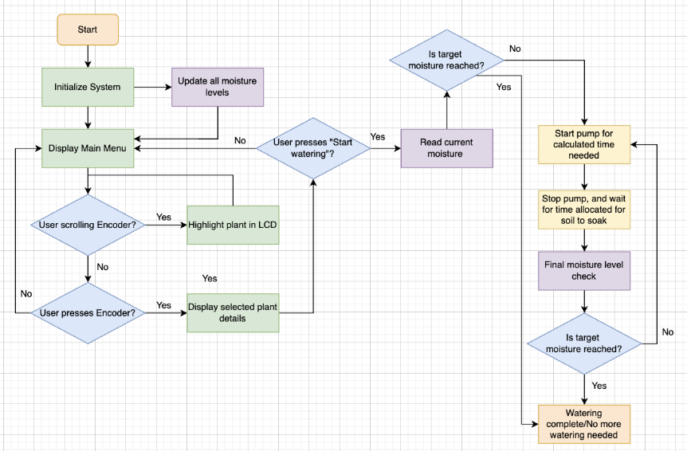
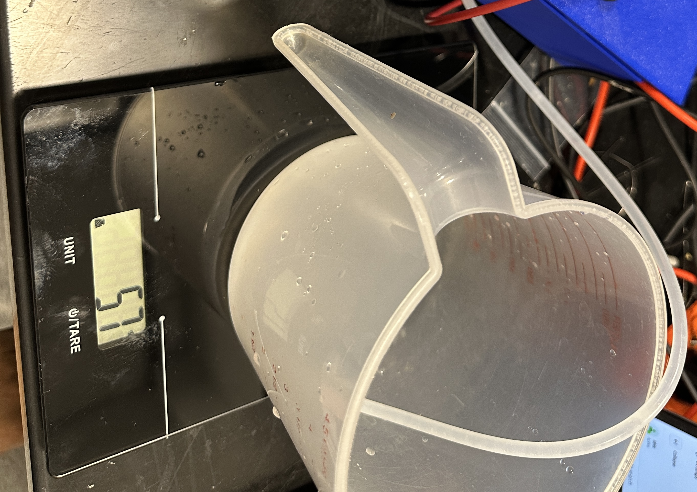
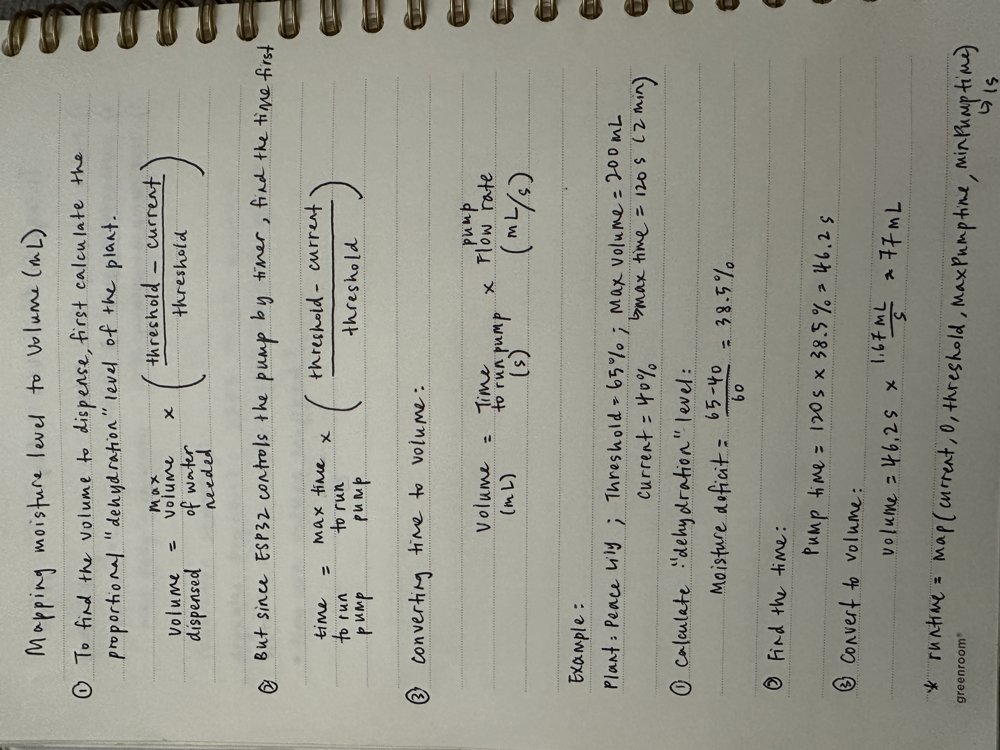

# March 30 - April 05

The control subsystem flowchart:

Now that I know the "updating moisture levels" block is done (more fine-tuning definitely needed), I'll focus on the other parts of subsystem.

I calibrated and tested the peristaltic pump. First I had to figure out the current draw of the pump when it's running, and it turns out to be ~0.5A.

On the prototype, I incorporated a MOSFET to act as a switch to the pump. The Gate of the MOSFET is connected to GPIO pin of ESP32 (control signal), Drain is connected to the negative terminal of the pump, while the Source is to ground. I also added a flyback diode between the positive and negative terminals of the pump so that when the pump is suddenly turned off, the voltage spike would have a safe path to dissipate and not fry the ESP32.  

I also did a test to calculate the pump flow rate. On the datasheet, it says that the flow rate is up to 100mL/min. At 5V, our pump's flow rate is 57mL/min. This is done by programming the pump to run for 1 minute and record the volume of water pumped. 

Now that I got the pump running, the next step is to figure out the pump runtime logic depending on different moisture level.

The formula: 

- Done prototyping for progress demo

# April 01
Individual Progress Report due 11.59pm