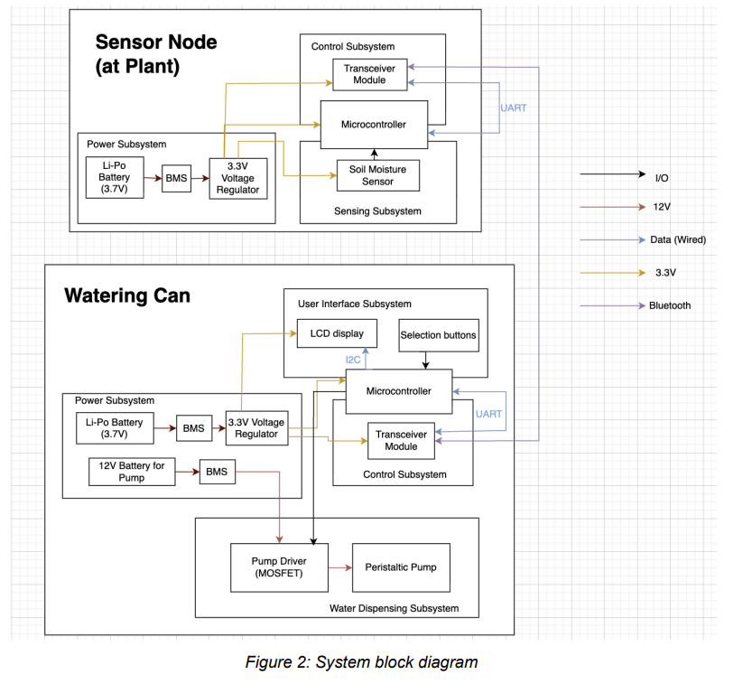

# WEEK 1

    Author: Idris Ispandi
    Feb 9 2026

### Pre TA meeting  
- Post- last week our project has been approved by and today we are meeting our  assigned TA __Mingrui Liu__

- Prior to meeting My teammate and I are seperating deliverables as follows: 
    - Your block diagram -  __Delilah__
    - Three high level requirements - __Idris__
    - Subsystem requirements (one for each subsystem) - __Delilah__
    - Lab notebook / laptop (if using Git) - __Idris__

    which is  in preparation for the Project Proposal and to aid our TA in understanding our scope

### Project Proposal    

Post discussing the project in the first meeting we discussed some key imprvement in our high level requirements and developed the proposal more thoroughly.

The Objective was to figure out what was the general hardware that we required and how it would be executed.

We decided on the following block diagram:

We decided to use the ESP-32s3 WROOM module as it was readily available at the E-shop and it has all the fucntionalities that we were targeting

We also were targeting a low power subsystem which would allow longevity of nodes and so we were exploring the idea of a 3.7V battery.

More specific details were outlined in the __Project Proposal__.

