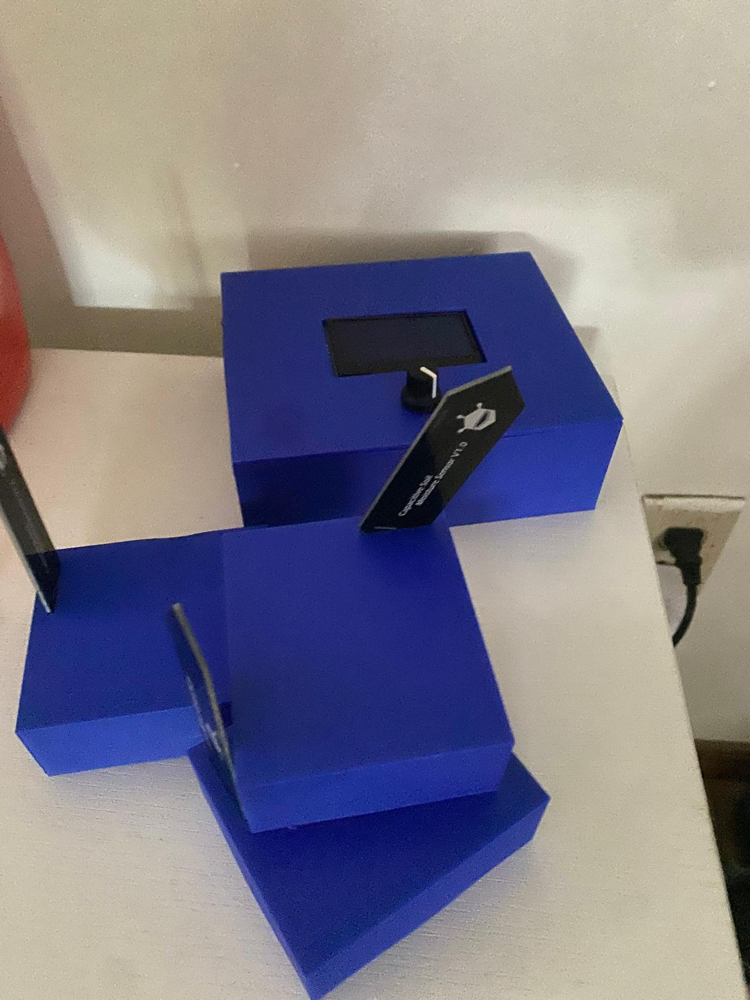

# WEEK 11

    Author: Idris Ispandi
    April 20 2026

### Mock Demo

At this point Charis has resolved the issue with the Power Problem on the sensor node and we had used the Sensor node as part of the Mock Demo

### Product development

At this point Charis was still resolving the issue of stepping down 7.4V to 5V and there was some immenent issues with that. 

In the meantime, I had figured out how to do CADing to use the 3D printer. I had printed 3 iteration of the design And finally settled on the below:  

While waiting for Charis to complete the board, I had helped Delilah to complete the validating and testing of the Requirements of the project.

Unfortnately during developemnt of the 4th board the Main PCB saw all power point connections but was not readable on the computer. We were running out of time to debug this so we decided to fall back onto the first round PCB and integrate the 7.4-5V step down functionality on the first round PCB.

And We finally got this to work as defined fully in our high level requirements.
