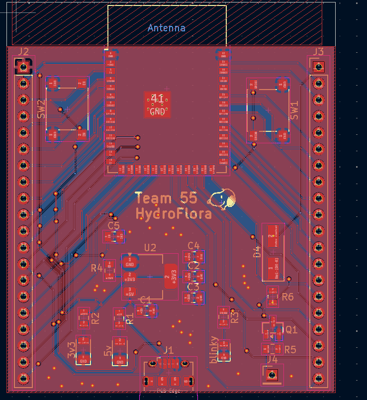
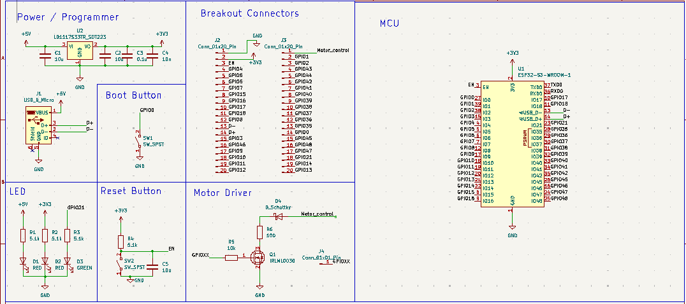

# WEEK 3

    Author: Idris Ispandi
    Feb 23 2026

### First Round PCB

After discussing with the TA during the __PCB Review__, They mostly said that our design looks good and only had minor suggestions such as routing for imporvemnt.At this point the functionality for ESP capability is pretty much secured if the board works. The next challenge is to convert the design into battery system.  With this feedback in mind we packgaed our design into a gerber file and sent it to __Mingrui__  for the first round PCB design:  






### Design Document
Upon further research we had a better idea of how our project would be executed and we developed the Design Document to capture all our ideas

Below are the improved Summary:

```
Hydroflora is a context-aware smart watering can system designed to make indoor plant watering more accurate and less dependent on guessing. The main problem it solves is that different plants need different amounts of water based on soil moisture, plant type, pot size, and current conditions. Instead of using a fixed schedule, Hydroflora uses real-time sensor data to decide how much water each plant actually needs.

The system is split into two main parts: the sensor nodes and the watering can controller. The sensor nodes are placed in each plant pot and use capacitive soil moisture sensors to measure the soil condition. These readings are sent wirelessly to the main watering can unit using Bluetooth/Wi-Fi. The watering can then compares the moisture reading to the target value for the selected plant and controls a peristaltic pump to dispense the calculated amount of water.

The user interacts with the system through an OLED display and a rotary knob. The display shows the selected plant and its current moisture percentage, while the rotary knob allows the user to switch between plant profiles. The system also includes safety logic so that if communication with a sensor node fails, the pump stays disabled instead of watering blindly.

The water dispensing subsystem uses a peristaltic pump driven by a MOSFET. A Schottky diode is included as a flyback diode to protect the ESP32 from voltage spikes when the motor turns off. The power subsystem uses a rechargeable LiPo battery, a boost converter to generate around 5 V for the pump, and an LDO regulator to generate 3.3 V for the microcontroller logic.

Overall, Hydroflora turns plant watering from a schedule-based task into a data-driven system. It reduces overwatering, prevents underwatering, saves water, and makes plant care easier for users with multiple indoor plants.
```

Below are the key improvemnt in requiremnts
## Key Requirements

| Requirement | Target |
|---|---|
| Dispensing accuracy | Within ±20% of target volume |
| Wireless range | At least 3 m indoors |
| Sensor node battery life | At least 24 hours |
| Sensor update interval | Every 5 minutes |
| Logic voltage | 3.3 V ± 5% |
| Pump voltage | 5.0 V ± 5% |
| Standby current | Below 100 µA |
| Pump safety | Pump disabled during communication failure |

Below are key equations that we will use to verify our design:

#### Soil Moisture Percentage

$$
\text{Moisture \%} =
\frac{\text{Raw Value} - \text{Dry Value}}
{\text{Wet Value} - \text{Dry Value}}
\times 100
$$


#### Average Sensor Node Current

$$
I_{\text{average}} =
\frac{
\left(I_{\text{transmit}} \times 5s\right)
+
\left(I_{\text{sleep}} \times 295s\right)
}
{300s}
$$


