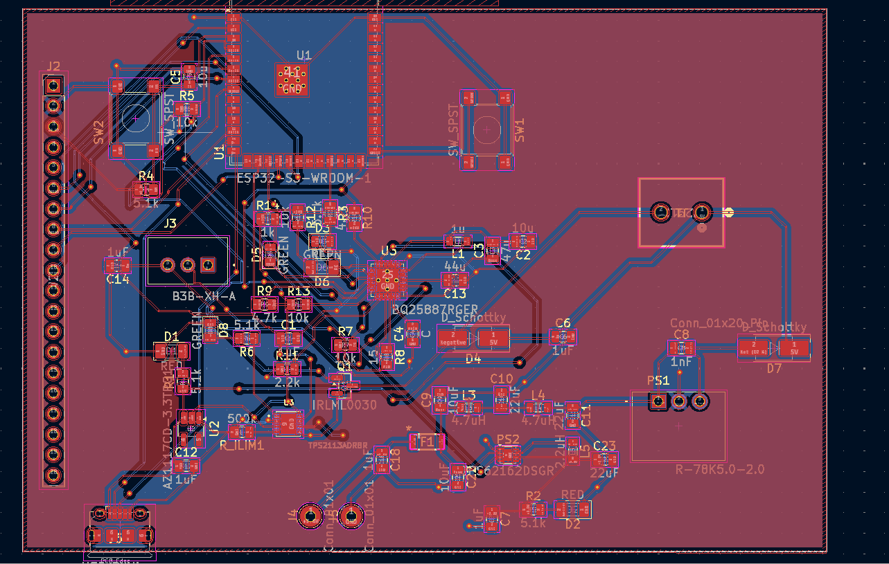
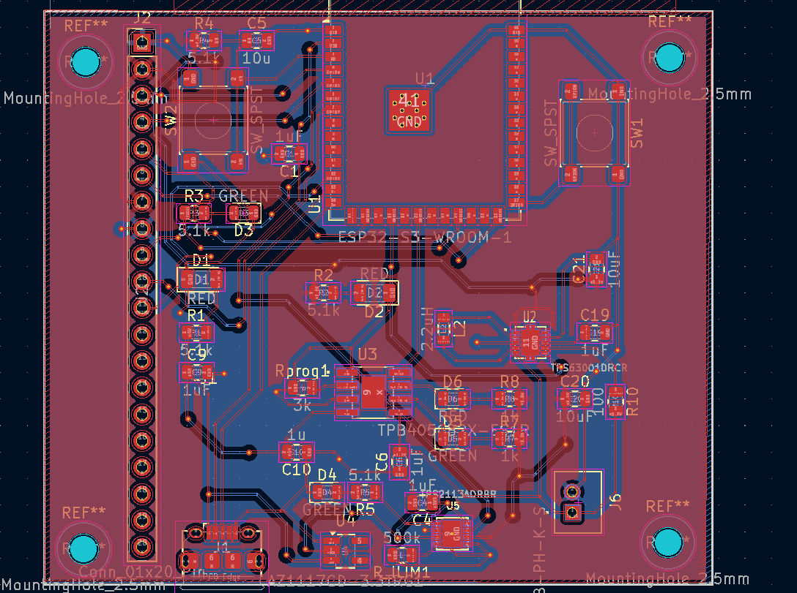

# WEEK 4

    Author: Idris Ispandi
    March 9 2026

### BreadBoard Demo

Upon getting feedback from the Design Review we began developing the prototype of the system. I supplied the Team with the ESP32's components required for prototyping.

For the breadboard DEmo I was responsible for routing and  defining Hardware level behaviour.

The functionality of the System at that point was:

1. The ESP is able to transmit and receive data
2. The ESP is able to drive an LED display with the transmitted data
3. ESP was also able to dynamically control the a standard motor.

### Third Round PCB

Charis had found more components to actively step down the 7.4V to 5V and 3.3V on the main PCB and 3.7V to 3.3V and this was incorporated in the latest submission.

